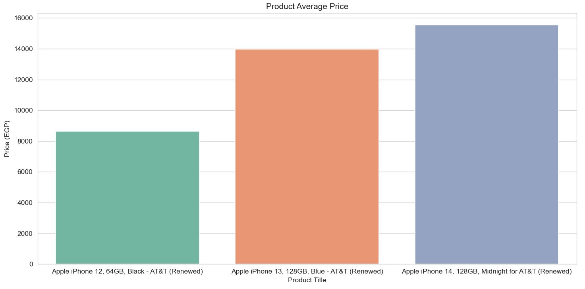

# 📦 Amazon Price Intelligence 

## 🛠 Tech Stack


A Python project that scrapes Amazon product prices, stores historical data, sends automated email reports, and performs price analysis with Pandas and Seaborn.

---

## 🚀 Features

- ✅ Scrapes product title and price from Amazon
- ✅ Handles multiple currencies (EGP, USD, GBP, EUR)
- ✅ Converts all prices to EGP
- ✅ Stores historical data in CSV
- ✅ Sends automated daily email reports
- ✅ Performs price analysis & visualization
- ✅ Clean modular project structure


---

## ⚙️ How It Works

1. The scraper sends a request to Amazon.
2. Extracts:
   - Product title
   - Product price
   - Currency
3. Saves data to CSV with today's date.
4. Converts all prices to EGP for Easier Analysis.
5. Generates a daily summary email.
6. Sends the report automatically.

---

## 📊 Example CSV Output

| Title | Price | Currency | Date |
| :--- | :--- | :--- | :--- |
| Apple iPhone 12 | 8353.66 | EGP | 2026-02-24 |
| Apple iPhone 13 | 184.64 | GBP | 2026-02-24 |
| Apple iPhone 14 | 200.98 | GBP | 2026-02-24 |

---

## 📧 Email Report Example
Daily Amazon Price Report

- iPhone 12: 8353 EGP
- iPhone 13: 184 GBP
- iPhone 14: 200 GBP


## 🔧 Configuration

Before running the script, update the `config.py` file with your credentials and settings.

```python
# ==============================
# Product URLs to Track
# ==============================

PRODUCT_URLS = [
    "https://www.amazon.com/product-1",
    "https://www.amazon.com/product-2",
    # Add more product URLs here
]


# ==============================
# Request Headers (Browser Simulation)
# ==============================

HEADERS = {
    "User-Agent": "Your Browser User-Agent",
    "Accept-Encoding": "gzip, deflate",
    "Accept": "text/html,application/xhtml+xml,application/xml;q=0.9,*/*;q=0.8",
    "DNT": "1",
    "Connection": "close",
    "Upgrade-Insecure-Requests": "1",
}


# ==============================
# Script Configuration
# ==============================

CHECK_INTERVAL = 86400   # 24 hours (in seconds)
CSV_FILE_NAME = "Amazon_Product_Dataset.csv"


# ==============================
# Email Configuration
# ==============================

EMAIL_ADDRESS = "your_email@gmail.com"
EMAIL_PASSWORD = "your_password"

SMTP_SERVER = "smtp.gmail.com"
SMTP_PORT = 465
```

#

## 📊 Visual Analysis

### 1️⃣ Product Average Price



### 2️⃣ Product Price Changes Over Time


---

### ▶️ How To Run

1. **Install dependencies:**
   ```bash
   pip install -r requirements.txt
2. **Start the application:**
   ```bash
   python main.py
3. **(Optional) Generate analysis plots:**
 ```bash
   python analysis.py

```
## 📂 Project Structure
```

.amazon-price-intelligence/
├── main.py                    # Main app loop
├── scraper.py                 # Scraping logic
├── reports.py                 # Daily report generation
├── email_utils.py             # Email sending logic
├── config.py                  # Configuration file
├── analysis.py                # Data analysis & visualization
├── Amazon_Product_Dataset.csv  # Raw data source
├── assets/                    # Folder for screenshots and images
│   ├── avg_price.png
│   └── price_trends.png
└── README.md                  # Project documentation

```


## 👨‍💻 Author

**Abdallah Ahmed**

*Python Developer | Data Enthusiast*

[](https://linkedin.com/in/abdallahahmed7)
[](https://github.com/AbdallahAhmed7)


